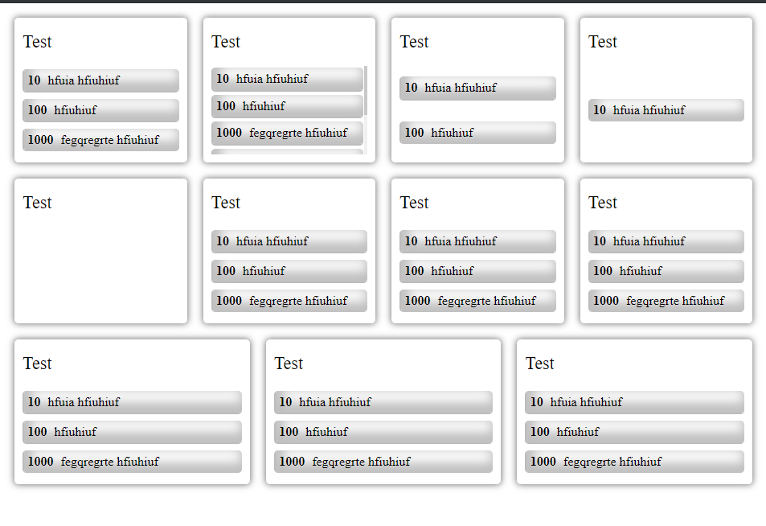

# Tile

This library was generated with [Angular CLI](https://github.com/angular/angular-cli) version 8.2.0.


## Installation and Usage

### ES6 via npm

```sh
npm i ras-tiles
```

### In Angular module import

In angular app import in module like below  

```ts
import { TileModule } from 'ras-tiles';

@NgModule({
  declarations: [
    AppComponent
  ],
  imports: [
    TileModule
  ]
  bootstrap: [AppComponent]
})
export class AppModule { }

```

### Angular component 

Usage in Component

```ts
import { Tile } from 'ras-tiles/lib/tile.model';


 tilesData: Tile[] = [
    {
      id: 'test1',
      title: 'Test1',
      infos: [
        {
          count: 10,
          info: 'Total'
        },
        {
          count: 1,
          info: 'Inactive'
        },
        {
          count: 2,
          info: 'Deleted'
        }
      ]
    },
    {
      id: 'test2',
      title: 'Test2',
      infos: [
        {
          count: 10,
          info: 'Total'
        }
      ]
    }
    ];


    tileClicked(id) {

    console.log(id);

  }

```

### Template

```html
<ras-tiles [tilesData]="tilesData" (tileClick)="tileClicked($event)"></ras-tiles>
```


### Result

 